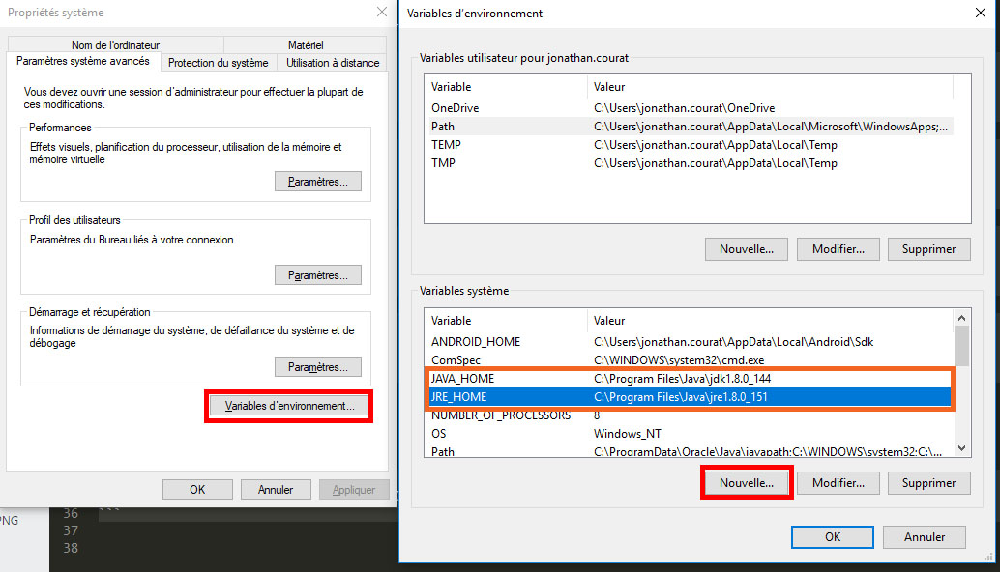

# JAVA


## Links -
+ [Tuto -path - check Java](https://confluence.atlassian.com/doc/setting-the-java_home-variable-in-windows-8895.html)
+ [Install Java (v8)](https://www.java.com/fr/download/)
+ [Install Maven](http://maven.apache.org)

## Installation
check if Java is installed and which version is running else install Java
Get the java (Runtime environment)
```bash
java -version
-> java version "1.8.0_051" bla bla
```
Get the version of the Java compiler
```bash
javac -version
->javac 1.8.0_144
```
Get the path of your java installation
```bash
echo %JAVA_HOME%
->C:\Program Files\Java\jdk1.8.0_144
```

```bash
java
-> some info 
```

**ENVIRONMENT VARIABLE !!!!!**




### Install maven

Project configuration:

```bash
mkdir -p folderProject/src/main/java/nameOfmyPackage
```

Add the pom.xml (maven Minimal example):
```xml
<?xml version="1.0" encoding="UTF-8"?>
<project>
    <modelVersion> 4.0.0</modelVersion> 
    <groupId>com.name.company</groupId>
    <artifactId>NameOfYourProject</artifactId>
    <version>1</version>
    <properties>
        <maven.compiler.source>1.8</maven.compiler.source>
        <maven.compiler.target>1.8</maven.compiler.target>
        <project.build.sourceEncoding>UTF-8</project.build.sourceEncoding>
    </properties>
</project>
```  


### first program:
In the nameOfmyPackage create a file `MainFile.java` who should be your entry point:
```java
package nameOfmyPackage;

public class Mainfile {
	public static void main(String[] args) {
		System.out.println("this is the main program here!");
	}
}
```

### Compile && install

Open bash at the root of your project
```bash
mvn compile
mvn install
java -cp target/NameOfYourProject-1.jar nameOfMyPackage.MainFile
```

### For the project HelloAgain

```bash
java -cp target/helloAgain-1.jar hello.Start
```

## Class & heritance

An abstract class Personnage (Personnage.java)

```java
package game;

public abstract class Personnage {
    protected String name = "none";
    protected String img = "url";
    protected int life = 100;
    protected int attack = 10;

    
    public void setName(String userName) {
        this.name = userName;
    }

    public void setImg(String imageLink) {
        this.img = imageLink;
    }

    public String getName() {
        return this.name;
    }

    public int getLife() {
        return this.life;
    }

    public void decreaseLife(int attackPower) {
        this.life -= attackPower;
        if (this.life < 0) {
            this.life =  0;
        } 
    }

    public void increaseLife(int energy) {
        this.life += energy; 
        if (this.life > 100) {
            this.life = 100;
        }
    }
}
```

A Warrior class extends Personnage with a construtor.(Warrior.java)
```java
package game;

public class Warrior extends Personnage {
  
    Warrior(String newName) {
        this.setName(newName);
    }
}
```

## Interface

An interface is a way to pass a contrat !
[A tutorial about interface](https://www.tutorialspoint.com/java/java_interfaces.htmb)
you can implement an interface in your class to force this one to have some attributs
or methods.
With various class who implements the same interface the same method could have a different action.

Game.java
```java
package game;

public class Game
{
    public static void main(String[] args) 
    {
        private static SpeakFr perso1 = new SpeakFr();
        private static SpeakFr perso2 = new SpeakGb();

        perso1.sayHi();
        perso2.sayHi();
    }   
}
```

SayHello.java
```java
package game;

public interface SayHello 
{
    void sayHi();
}
```

SpeakFr.java
```java
package game;

public class SpeakFr implements SayHello
{
    public void sayHi()
    {
        System.out.println("Bonjour");
    }
}
```

SpeakGb.java
```java
package game;

public class SpeakGb implements SayHello
{
    public void sayHi()
    {
        System.out.println("Hello");
    }
}
```

## JBDC

### STEP 1 
[DownLoad JDBC mySql](https://dev.mysql.com/downloads/connector/j/5.1.html)

- UnCompress
- copy the mysql-connector-java-5.1.46-bin.jar
- Paste in C:\Program Files\Java\jre1.8.0_151\lib\ext


### STEP 2 (IntelliJ)
File > project structure
Project setting Modules

Clic on Dependencies
Clic on the green Plus sign > Jar or directories
Select the mysql-connector-java-5.1.46-bin.jar in the arborecence


### Create the DB


### Make the first connection for test

```java
 try 
 {    
    Class.forName("com.mysql.jdbc.Driver");
    System.out.println("Driver O.K.");

    String url = "jdbc:mysql://localhost:3306/databaseNAme";
    String user = "user";
    String passwd = "pwd";

    Connection conn = DriverManager.getConnection(url, user, passwd);
    System.out.println("Connexion effective !");

} 
catch (Exception e) 
{
    e.printStackTrace();
}

```

### Show the content of a table

We admit we have a table called `personnage`

```java
try 
{
    Class.forName("com.mysql.jdbc.Driver");
    System.out.println("Driver O.K.");

    String url = "jdbc:mysql://localhost:3306/databaseNAme";
    String user = "user";
    String passwd = "pwd";

    Connection conn = DriverManager.getConnection(url, user, passwd);
    System.out.println("Connexion effective !");

    Statement state = conn.createStatement();
    ResultSet result = state.executeQuery("SELECT * FROM personnage");
    ResultSetMetaData resultMeta = result.getMetaData();

    System.out.println("\n**********************************");
            
    for(int i = 1; i <= resultMeta.getColumnCount(); i++)
        System.out.print("\t" + resultMeta.getColumnName(i).toUpperCase() + "\t *");

    System.out.println("\n**********************************");

    while(result.next())
    {
        for(int i = 1; i <= resultMeta.getColumnCount(); i++)
            System.out.print("\t" + result.getObject(i).toString() + "\t |");

        System.out.println("\n---------------------------------");
    }
    result.close();
    state.close();

} 
catch (Exception e) 
{
    e.printStackTrace();
}
```

### Crud example

```java

package game;


import java.sql.*;
import java.util.Scanner;

/* Test CRUD for the table personnage in BDD dungeon */

public class Game {

    private static Boolean play = true;
    private static Scanner scInt = new Scanner(System.in);
    private static Scanner scStr = new Scanner(System.in);
    private static Connection conn;

    public static void main(String[] args) 
    {


        System.out.println("test DB");

        try {
            //Class.forName("com.mysql.jdbc.Driver");
            System.out.println("Driver O.K.");

            String url = "jdbc:mysql://localhost:3306/dungeon";
            String user = "user";
            String passwd = "123";

            conn = DriverManager.getConnection(url, user, passwd);
            System.out.println("Connexion effective !");

            while (play)
            {
                System.out.println("MENU\n1- CREATE \n2- READ \n3- UPDATE \n4- DELETE \n5- SHOW ALL");
                int choixUtilisateur = scInt.nextInt();
                switch (choixUtilisateur) {
                    case 1:
                        //-- creer Un personnage
                        createPersonnage();
                        break;
                    case 2:
                        //-- afficher un personnage
                        readPersonnage();
                        break;
                    case 3:
                        //-- Changer le nom du personnage
                        updatePersonnage();
                        break;
                    case 4:
                        deletePersonage();
                        break;
                    case 5:
                        showPersonage();
                        break;
                    default:
                        System.out.println("Make a valide choice");
                }
            }

        } catch (Exception e) {
            e.printStackTrace();
        }


    }

    /*----------------------------------------*/
            PLEASE NOT IN THE MAIN
    /*----------------------------------------*/


    public static void createPersonnage()
    {
         Scanner scInteger = new Scanner(System.in);
         Scanner scString = new Scanner(System.in);

         String name;
         int life, type;

         System.out.println("CREATE A PERSONNAGE:");
         System.out.println("Set a Name:");
         name = scString.nextLine();

         System.out.println("Set life:");
         life = scInteger.nextInt();

         System.out.println("Set Type (1- guerrier 2- Magicien:");
         type = scInteger.nextInt();


        try
        {
            PreparedStatement newPersonnage = conn.prepareStatement("INSERT  into personnage(name, life, type) VALUE (?,?,?)");
            newPersonnage.setString(1,name);
            newPersonnage.setInt(2,life);
            newPersonnage.setInt(3,type);
            newPersonnage.executeUpdate();
        }
        catch (SQLException e)
        {
            e.printStackTrace();
        }
    }

    public static void readPersonnage()
    {
        System.out.println("READ A PERSONNAGE:");
        System.out.println("Set an ID to read:");
        int id = scInt.nextInt();
        try
        {
            Statement state = conn.createStatement();
            ResultSet result = state.executeQuery("SELECT * FROM personnage WHERE id = " + id);
            ResultSetMetaData resultMeta = result.getMetaData();
            System.out.println("\n**********************************");

            for(int i = 1; i <= resultMeta.getColumnCount(); i++)
                System.out.print("\t" + resultMeta.getColumnName(i).toUpperCase() + "\t *");

            System.out.println("\n**********************************");

            while(result.next())
            {
                for(int i = 1; i <= resultMeta.getColumnCount(); i++)
                    System.out.print("\t" + result.getObject(i).toString() + "\t |");

                System.out.println("\n---------------------------------");

            }
            result.close();
            state.close();

        }
        catch (SQLException e)
        {
            e.printStackTrace();
        }

    }


    public static void updatePersonnage()
    {
        System.out.println("UPDATE A PERSONNAGE:");
        System.out.println("Set an ID to update:");
        int id = scInt.nextInt();
        try
        {
            System.out.println("Change name: ");
            String newName = scStr.nextLine();

            System.out.println("Change life: ");
            int newLife = scInt.nextInt();
            PreparedStatement newPersonnage = conn.prepareStatement("UPDATE personnage SET name=?, life = ? where id=?");
            newPersonnage.setString(1,newName);
            newPersonnage.setInt(2,newLife);
            newPersonnage.setInt(3,id);
            newPersonnage.executeUpdate();
        }
        catch (SQLException e)
        {
            e.printStackTrace();
        }

    }


    public static void deletePersonage()
    {
        System.out.println("DELETE A PERSONNAGE:");
        System.out.println("Set an ID to delete:");
        int id = scInt.nextInt();
        try
        {
            PreparedStatement deletePersonnage = conn.prepareStatement("DELETE FROM personnage WHERE personnage.id = ?");
            deletePersonnage.setInt(1,id);
            deletePersonnage.executeUpdate();
        }
        catch (SQLException e)
        {
            e.printStackTrace();
        }
    }

    public static void showPersonage()
    {
        System.out.println("SHOW PERSONNAGE TABLE:");
        try
        {

            Statement state = conn.createStatement();
            ResultSet result = state.executeQuery("SELECT * FROM personnage");
            ResultSetMetaData resultMeta = result.getMetaData();
            System.out.println("\n**********************************");

            for(int i = 1; i <= resultMeta.getColumnCount(); i++)
                System.out.print("\t" + resultMeta.getColumnName(i).toUpperCase() + "\t *");

            System.out.println("\n**********************************");

            while(result.next())
            {
                for(int i = 1; i <= resultMeta.getColumnCount(); i++)
                    System.out.print("\t" + result.getObject(i).toString() + "\t |");

                System.out.println("\n---------------------------------");

            }
            result.close();
            state.close();

        }
        catch (Exception e)
        {
            e.printStackTrace();
        }
    }
}
```